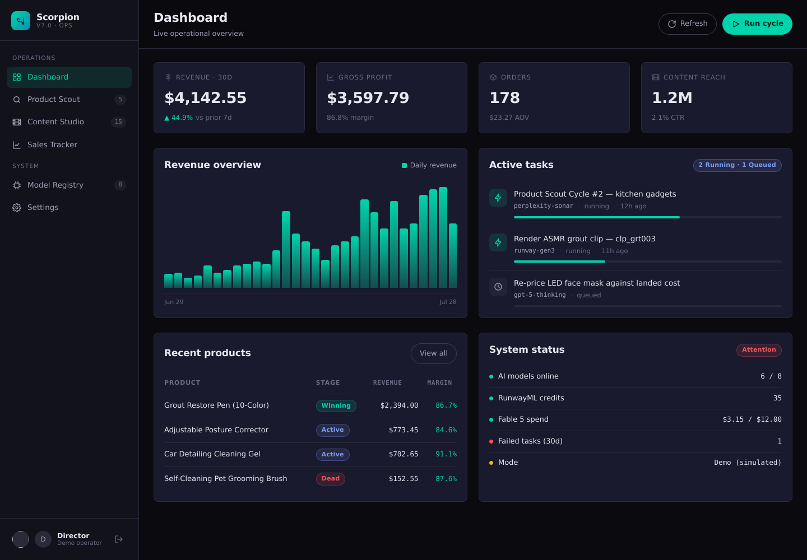
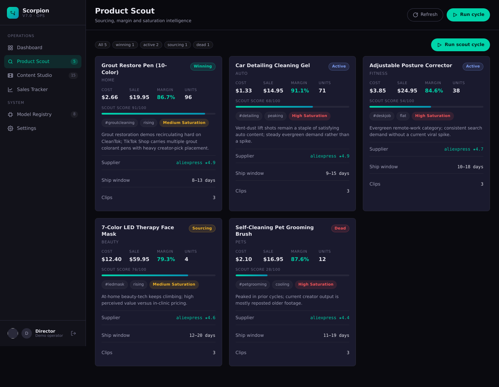
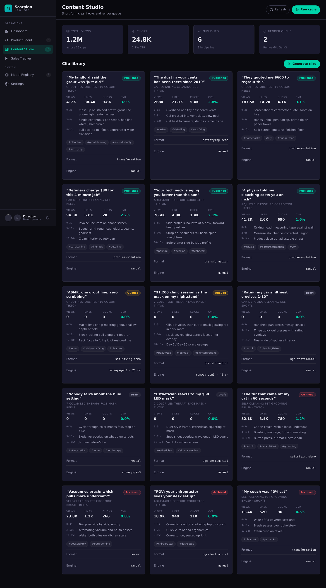
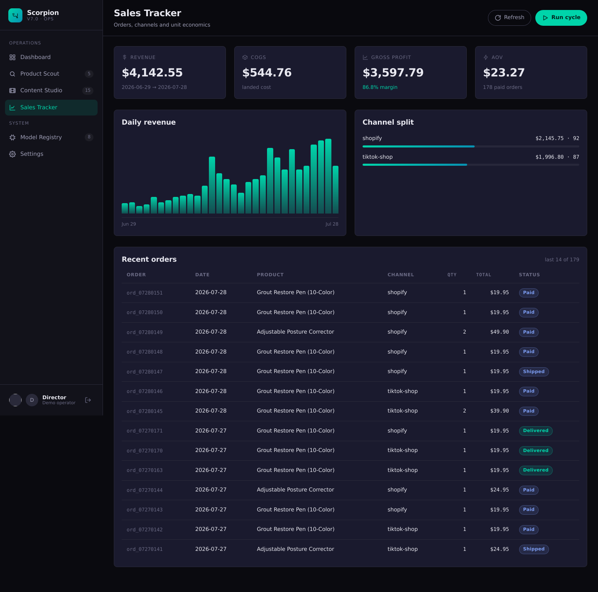
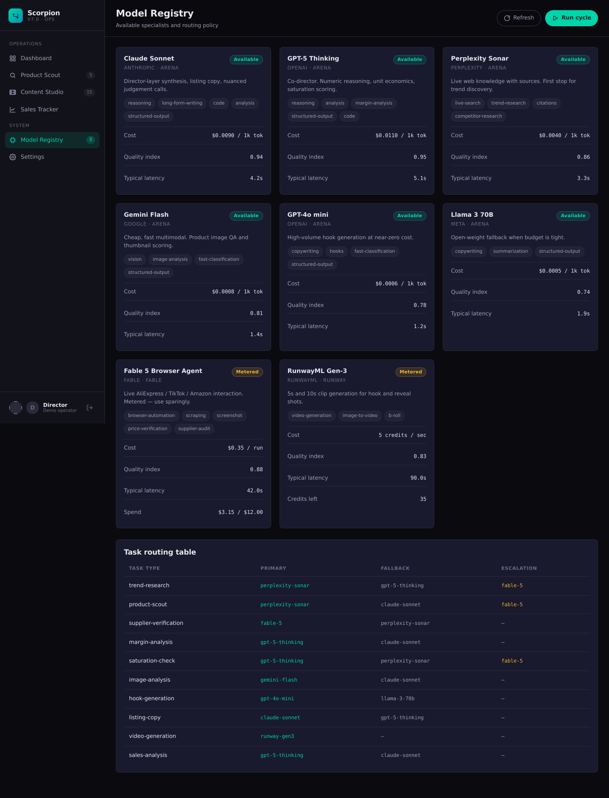

# Scorpion 7.0

Autonomous AI operations platform for running a dropshipping business — product research,
content generation, and revenue tracking in one console, with model routing across
Arena.ai, Fable 5 and RunwayML.

Static frontend, Node scripts, JSON data files. No framework, no build step, no database.

```
npm run seed     # populate data/ with demo data
npm start        # http://localhost:4173
npm test         # 106 tests, no dependencies
```

> **Status: scaffold with simulated integrations.** The console, orchestrator,
> routing and audit tooling all work. No API keys are configured, so Arena.ai,
> Fable 5 and RunwayML calls return simulated responses and cached fixtures.
> Nothing here has spent money or touched a real storefront.
> See **[docs/PROJECT_STATUS.md](docs/PROJECT_STATUS.md)** for the full picture.

---

## What it does

| Module | Purpose |
|---|---|
| **Product Scout** | Finds products matching margin, trend and saturation criteria. Routes trend research to Perplexity, live sourcing to Fable 5, analysis to GPT-5/Claude |
| **Content Studio** | Turns products into three-beat short-form clip specs, queues renders on RunwayML |
| **Sales Tracker** | Ingests Shopify / TikTok Shop / Amazon orders, recalculates unit economics |
| **Model Registry** | Catalog of available specialists, routing table, cost ceilings and spend tracking |

The console reads `data/*.json` over `fetch`. The orchestrator writes those same files.
That's the entire contract between frontend and backend.

---

## Screens


*Dashboard — KPIs, 30-day revenue chart, live task queue, system status*

| Product Scout | Content Studio |
|---|---|
|  |  |

| Sales Tracker | Model Registry |
|---|---|
|  |  |

More in [`docs/screenshots/`](docs/screenshots/), including mobile and the auth gate.

---

## Quick start

```bash
git clone https://github.com/juanrivaslucena-source/scorpion-7.0
cd scorpion-7.0
npm run seed
npm start
```

Open http://localhost:4173 and click **Explore demo mode** — no credentials needed.

The seeded state is a dropshipping operation mid-flight: 5 products across every lifecycle
stage, 15 content clips, 30 days of sales totalling ~$4,143 across Shopify and TikTok Shop,
and 2 AI tasks actively running.

### Running the orchestrator

```bash
npm run orchestrate:once                      # drain the queue and exit
npm run scout                                 # one product-scout cycle
node scripts/orchestrate.js --interval 30     # watch mode
node scripts/orchestrate.js --dry-run --once  # no writes
```

---

## Live vs simulated

Every external service degrades gracefully. With no keys set, the whole system runs
end-to-end on simulated responses and cached fixtures.

| Variable | Live behaviour | Unset behaviour |
|---|---|---|
| `ARENA_API_KEY` | Routes to 100+ real models | Deterministic simulated responses |
| `FABLE_API_KEY` | Live browser automation | Fixtures captured from real AliExpress pages |
| `RUNWAY_API_KEY` | Real Gen-3 renders | Simulated job ids, credits debited locally |

Browser-side keys go in **Settings** and live in `localStorage` only. Node-side keys come
from the environment.

---

## Design audit → Claude Code

Visual bugs survive unit tests. The icon-sizing bug that made KPI glyphs render
at 164px passed every static check because the markup was valid — it just looked
wrong. `npm run design:audit` catches that class of defect by rendering the app
in real Chromium and inspecting the live DOM.

```bash
npm run design:audit    # render every view, write design-report/
npm run design:fix      # audit, hand the brief to Claude Code, re-audit
npm run verify          # tests + audit, the pre-commit gate
```

**What it checks**, at 1440px and 390px across all six views: oversized icons,
clipped content, page-level horizontal scroll, overlapping text, WCAG AA
contrast, touch-target size, accessible names, `undefined`/`NaN` leaking into
the UI, blank views, and console errors.

**Output** lands in `design-report/` (gitignored):

| File | Purpose |
|---|---|
| `FIXME.md` | Prioritized work order written for Claude Code |
| `REPORT.md` | Human-readable summary |
| `report.json` | Machine-readable findings |
| `screens/` | 12 screenshots |

Findings are grouped by root cause — one failing colour variable appearing 33
times becomes one task, not 33.

### The handoff

`npm run design:fix` runs the audit, then invokes the Claude Code CLI against
`design-report/FIXME.md` and re-audits to confirm the fixes landed. Repo
conventions and guardrails live in [`CLAUDE.md`](CLAUDE.md).

```bash
npm install -g @anthropic-ai/claude-code   # once
npm run design:fix                          # audit → fix → verify
npm run design:fix:dry                      # preview the prompt only
```

Or drive it manually:

```bash
npm run design:audit
claude "read design-report/FIXME.md and fix every task in it"
```

**No dependencies.** The audit drives Chromium over the DevTools Protocol using
Node's built-in WebSocket — no Playwright, no Puppeteer. If no browser is
present it provisions one into `.cache/chromium/` (also gitignored). Set
`CHROMIUM_PATH` to use your own.

### CI

A ready-made GitHub Actions workflow lives at
[`docs/ci/design-audit.yml.example`](docs/ci/design-audit.yml.example). It runs
the tests and the audit on every push and uploads the report as an artifact. To
enable it:

```bash
mkdir -p .github/workflows
cp docs/ci/design-audit.yml.example .github/workflows/design-audit.yml
git add .github && git commit -m "Enable design audit CI" && git push
```

(It ships as a template because GitHub Apps cannot create workflow files
without the `workflows` permission.)

---

## Layout

```
scorpion-7.0/
├── index.html                  Dashboard shell
├── assets/
│   ├── css/dashboard.css       Entire theme
│   └── js/
│       ├── api.js              Data loading, formatting, service wrappers
│       ├── auth.js             GitHub OAuth + demo session
│       ├── router.js           Browser-side task router
│       ├── dashboard.js        View rendering
│       └── app.js              Boot, navigation, events
├── modules/
│   ├── product-scout/          scout.js + product schema
│   ├── content-studio/         studio.js + clip schema
│   ├── sales-tracker/          tracker.js + sales schema
│   └── model-registry/         registry.js + models.json
├── data/
│   ├── products.json           Live state
│   ├── content.json
│   ├── sales.json
│   ├── tasks.json
│   └── seed/                   Demo data
├── scripts/
│   ├── orchestrate.js          Main loop
│   ├── arena-router.js         Arena.ai integration
│   ├── fable-agent.js          Fable 5 integration
│   ├── dev-server.js           Static server
│   └── seed.js                 Seeder
├── pipeline/
│   ├── PIPELINE.md             Architecture
│   └── COMMAND_CENTER.md       Director protocol
└── auth/callback.html          OAuth callback
```

---

## Authentication

GitHub OAuth needs a server-side token exchange — the client secret can't ship to the
browser. Configure your endpoint in **Settings → GitHub OAuth**; `pipeline/PIPELINE.md`
has a copy-paste Vercel function.

Until then, demo mode gives you a full local session.

---

## Deployment

**GitHub Pages** — Settings → Pages → deploy from `main`, root directory. Everything is
static.

**Vercel** — import the repo, preset "Other", no build command, output directory `.`.

A GitHub Action running `npm run orchestrate:once` on a cron and committing the JSON diff
gives you an autonomous loop with no always-on server.

---

## Documentation

New here? **[KICKOFF.md](KICKOFF.md)** tells you which tool to hand this to and
what to paste. **[docs/PROJECT_STATUS.md](docs/PROJECT_STATUS.md)** is the honest
account of what is real, what is simulated, and what still needs a human.

- **[KICKOFF.md](KICKOFF.md)** — ready-to-paste prompts for Claude Code, battle mode, and the audit loop
- **[docs/PROJECT_STATUS.md](docs/PROJECT_STATUS.md)** — integration reality, data provenance, bugs found and how, open decisions
- **[docs/DECISIONS.md](docs/DECISIONS.md)** — architectural decisions with rationale and revisit criteria
- **[pipeline/PIPELINE.md](pipeline/PIPELINE.md)** — architecture, task lifecycle, model routing, deployment
- **[pipeline/COMMAND_CENTER.md](pipeline/COMMAND_CENTER.md)** — director protocol, product criteria, kill rules, content rules
- **[CLAUDE.md](CLAUDE.md)** — conventions and guardrails for coding agents

### Status at a glance

| | |
|---|---|
| Tests | 106 passing, no dependencies, no network |
| Design audit | 0 errors, 4 warnings |
| Live API integrations | None connected — all simulated or fixtures |
| Money spent | $0 |
